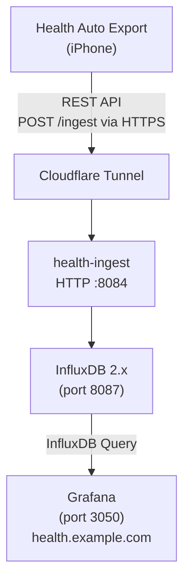

# Apple Health Backup & Analysis System

A self-hosted system to backup, store, and analyze Apple Health data exported from the [Health Auto Export](https://apps.apple.com/app/health-auto-export-json-csv/id1115567069) iOS app. Data flows via REST API to InfluxDB for time-series storage, with Grafana dashboards for visualization and AI-powered weekly health insights.

## Architecture



## Prerequisites

- **Docker** and **Docker Compose** v2+
- **Python 3.13+** (for local development)
- **[uv](https://github.com/astral-sh/uv)** package manager (for local development)
- **Health Auto Export** iOS app (paid, ~$3)
- **AI provider API key** (optional, for AI-powered weekly reports)

## Quick Start

### 1. Clone and Configure

```bash
git clone https://github.com/po4yka/apple-health-export-automation-backup.git
cd apple-health-export-automation-backup

# Create environment file
cp .env.example .env
```

Edit `.env` with your settings:

```bash
# Required: Generate a secure token for InfluxDB
INFLUXDB_TOKEN=$(openssl rand -hex 32)
INFLUXDB_ADMIN_PASSWORD=$(openssl rand -base64 16)
GRAFANA_ADMIN_PASSWORD=$(openssl rand -base64 16)

# Optional: For AI weekly reports
INSIGHT_AI_PROVIDER=anthropic
ANTHROPIC_API_KEY=sk-ant-...
```

### 2. Create Storage Directories

```bash
mkdir -p ./data/{influxdb,influxdb-config,grafana,archive,dedup,dlq}
```

### 3. Start the Stack

```bash
docker compose up -d
```

### 4. Verify Services

```bash
# Check all services are running
docker compose ps

# View ingestion logs
docker logs -f health-ingest
```

### 5. Access Dashboards

- **Grafana**: http://localhost:3050 (admin / your password)
- **InfluxDB**: http://localhost:8087 (admin / your password)

### 6. Grafana Dashboards

Grafana provisions two dashboards automatically under the **Apple Health** folder:

- **Apple Health Overview**: Daily activity, heart metrics, sleep stages, workouts, and vitals.
- **Apple Health Trends**: 7-day moving averages and longer-term trends across activity, cardio fitness, sleep consistency, and body/vital stats.

To modify panels, export the dashboard JSON from Grafana and overwrite the matching file in `grafana/provisioning/dashboards/`.

## Configuration at a Glance

The full configuration lives in `.env`. Start by copying `.env.example` and filling out the required values. See [docs/configuration.md](docs/configuration.md) for the complete reference.

| Setting | Required | Description |
|---------|----------|-------------|
| `HTTP_AUTH_TOKEN` | Yes | Bearer token used by the iOS app to authenticate REST API uploads. |
| `INFLUXDB_TOKEN` | Yes | Token used by the ingest service and Grafana to write/query data. |
| `INFLUXDB_ADMIN_PASSWORD` | Yes | Initial InfluxDB UI admin password (first run only). |
| `GRAFANA_ADMIN_PASSWORD` | Yes | Grafana admin password. |
| `INSIGHT_AI_PROVIDER` | Optional | Enable weekly AI report generation (`anthropic`, `openai`, `grok`). |

Tip: Use `openssl rand -hex 32` for tokens and `openssl rand -base64 16` for passwords.

## Services

| Service | Container | Port | Description |
|---------|-----------|------|-------------|
| health-ingest | `health-ingest` | 8084 | REST API ingestion, transforms and writes to InfluxDB |
| InfluxDB | `health-influxdb` | 8087 | Time-series database for health metrics |
| Grafana | `health-grafana` | 3050 | Visualization dashboards |

## Documentation

| Document | Description |
|----------|-------------|
| [Configuration Reference](docs/configuration.md) | All environment variables, persistent storage layout |
| [Data Model](docs/data-model.md) | InfluxDB schema, measurements, supported workout types |
| [Development](docs/development.md) | Local setup, testing, linting, CLI commands |
| [Operations](docs/operations.md) | Troubleshooting, security notes, backups, Cloudflare Tunnel |
| [iOS App Setup](docs/ios-app-setup.md) | Health Auto Export configuration and recommended metrics |

## License

MIT License - see [LICENSE](LICENSE) for details.
